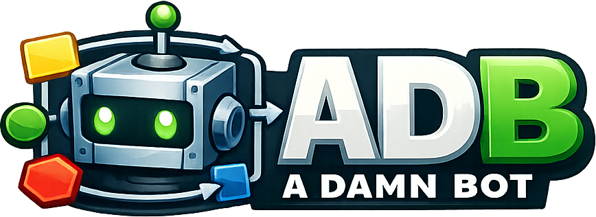

# ADB: A Damn Bot 🤖



*You've got games to NOT play. Let a damn bot do the grinding.*

Why click 10,000 times when a damn bot will click 10,001 and never complain? ADB is a Windows desktop toolkit for building UI-automation bots that grind **Windows games**, **Android devices** (over `adb`), and **web browsers** (via Playwright) while you go touch grass. Drag actions onto a canvas, wire 'em up, point them at a target, and walk away a richer person (in-game currency only — we make no promises).

> Windows-only (WPF). Targets .NET 10 (`net10.0-windows`). The name is a backronym and we are deeply proud of it.

## What's in this glorious box

| Project | Kind | What it actually does |
| --- | --- | --- |
| **BotBuilder** | WPF app | The lab. Drag actions onto a canvas, wire them up, assign targets, test-run, cackle. |
| **BotRunner** | Console app | The night-shift worker. Runs a saved `.bot` file headlessly — scripts, Task Scheduler, set-it-and-forget-it grinding. |
| **BotCapture** | WPF app | The eyes. Snip template images from a window so your bot knows what "the shiny button" looks like. |
| **AdbCore** | Library | The brain. Action definitions, execution, target binding, screen capture, image matching, OCR, browser & Android drivers, Lua scripting. Everything that makes the bot *damn*. |
| **AdbUi.Theme** | Library | The wardrobe. Light / Dark / High-Contrast, because grinding at 3 a.m. shouldn't blind you. |
| `*.Core` / `*.Tests` | Libraries | The responsible adults. Testable logic layers + xUnit suites that keep the chaos from becoming *actual* chaos. |

## Concepts (the lore)

- **Bot** — a graph of action nodes wired together by success/failure paths, saved as a `.bot` file (JSON). It's a flowchart that gets off the couch and does the work. Template images are **embedded right in the file** (base64), so a `.bot` is self-contained — hand it to a friend and it still knows what the loot button looks like, no loose PNGs to lug around.
- **Action** — one move (tap, click, type, find image, read text, run Lua, …), sorted into palette **categories**: Control Flow, Screen, Input, Window, Android, Browser, Data, Scripting. Mix and match into combos.
- **Target** — the poor victim of your automation. Three kinds, summoned with a selector string:
  - **Window** — `process:<name>`, `title:<window title>`, or `hwnd:<handle>` (e.g. `hwnd:0x1A2B`)
  - **Android** — `serial:<device serial>`
  - **Browser** — `browser:<engine>` where engine is `chromium`, `firefox`, or `webkit`

  Type-specific actions snap to the right target on their own, and the editor's target picker writes the selectors for you — because nobody has memorized a selector syntax willingly, ever.
- **Nested bot** — a whole bot stuffed *inside* another bot. Build a gnarly sub-routine once (the classic: "claw your way back to the main menu from wherever the game dumped me"), and it lives in this file's reusable library. Drop a single **Nested Bot** card (Control Flow) wherever you need it instead of copy-pasting forty nodes — double-click the card to edit the sub-bot in its own window, and rename it once to update every card that points at it. Optionally **send** your variables and targets in and **receive** its variables back; the parent bot takes a coffee break while the nested one runs. (It won't let a bot reference itself in a loop, so no infinite turtles.) When it runs, each action inside logs a `[BotName]`-prefixed line so you can see what the sub-bot is up to.

## The arsenal

- **Visual node-graph editor** — drag/drop palette, multi-select, copy/paste, undo/redo, **right-drag from a card's body to wire it up** (for those of us cursed with bad aim), **drag a live wire's tail onto a node to drop it right into the flow** (hello, retroactive Delays), and **"Tidy Up"** auto-layout for when your masterpiece looks like a plate of spaghetti. Tidy Up now **snakes** long graphs into tidy rows that fit your canvas (reversed rows flip their ports so the wires stay clean), and the toolbox/properties panels **fold away to rails** (Ctrl+[ / Ctrl+]) when you need elbow room.
- **Save-before-you-rage-quit** — ADB now nags you to save before you slam New, Open, or the close button on unsaved work, so a mistimed click never eats your bot.
- **Nested bots** — encapsulate a chunk of logic as a reusable sub-bot and drop it in as one **Nested Bot** card. Share it across as many cards as you like, edit it in its own window, optionally pass variables/targets in and pull variables back, **import** an existing `.bot` to fold a copy into the parent file, or **export** one back out into its own standalone `.bot` — bundled with everything it calls and ready to run solo. Keeps a sprawling graph from collapsing into a 200-node hairball.
- **Global error handler** — drop one **Error Handler** node and any unhandled faceplant routes *there* instead of killing the run. Wire its output back to "reboot the device and start over" and you've got a bot that dusts itself off and keeps grinding while you sleep. It even hands your recovery flow the wreckage — `${error.message}`, `${error.action}` — so it knows what just went wrong.
- **Throw Error** — rage-quit the current flow with a message. Blows past loops and pops you out of a nested bot back to the parent (or into your Error Handler if you wired one).
- **Image matching** (OpenCvSharp) — find / wait-for / assert-absent template images on Screen *and* Android, with a coordinate & region picker. Hit **Capture**, snip the loot button once — it's baked straight into the `.bot` (no loose PNGs, no clutter in your working directory) — and it clicks it until the heat death of the universe.
- **Capture Frame** — snap the screen *once*, then let a whole gang of Find Image reads feed off that single frame instead of re-grabbing pixels every time. Works on windows *and* phones. Flip a reader's **Source** to *Stored* and point it at your frame's name.
- **Measure Bar** — got a health/XP/stat bar? Read its value straight off the pixels in one scan instead of
  matching a pile of images. Tell it the fill (and/or empty) colour, the region, and 0..15 — it hands back the
  number. Windows *and* Android.
- **OCR** (Tesseract, bundled `eng`) — read / find / wait-for / assert-absent text. Reads your gold counter, your cooldowns, and the "YOU DIED" screen so the bot knows when to ragequit gracefully.
- **Lua scripting** (MoonSharp) — a "Run Lua Script" action with `http`, `json`, `fs`, `process`, and `log` host APIs for whenever the visual blocks aren't enough and you need to go full mad scientist.
- **Input & windows** — mouse/keyboard actions, activate window, and on Android: tap, long-press, swipe, send text (plain, or **full Unicode via ADBKeyboard**), and hammer a key (Backspace ×50 to nuke a field). The clicky-clicky.
- **Theming** — Light / Dark / High-Contrast, following the OS by default (`View ▸ Theme` in BotBuilder).

## Lua IntelliSense (VS Code autocomplete)

The "Run Lua Script" action has an **Edit** button that opens your script in an external editor. Every time you hit Edit, BotBuilder drops two files into `%TEMP%\ADB\LuaEdit`:

| File | What it is |
| --- | --- |
| `.luarc.json` | LuaLS workspace config — sets Lua 5.2 runtime, points at `library/`, declares all six ADB globals, and disables the `io` and `debug` libraries (gone in the sandbox). |
| `library\adb.lua` | `---@meta` annotation file with full type signatures for `log`, `vars`, `json`, `fs`, `process`, and `http`. |

It also tells you what's **not** there. ADB runs scripts in MoonSharp's soft sandbox, so the dangerous standard-library bits are stripped — `os.execute`, `os.getenv`, `os.remove`/`os.rename`, `load`/`loadfile`/`dofile`, `require`, and all of `io` and `debug`. Those are annotated `@deprecated` (editors strike them through, with a "use `process.run` / `fs` instead" hint), so you find out in the editor rather than at run time. The harmless bits stay: `os.time`/`os.date`/`os.clock`, and the `string`/`table`/`math`/`coroutine` libraries.

To get autocomplete in **VS Code** (with the [Lua extension](https://marketplace.visualstudio.com/items?itemName=sumneko.lua) installed), the catch is that LuaLS only reads `.luarc.json` when a **folder** is open — not a lone file. So set your editor command to open the folder:

```
code --wait $directory $filename
```

`$directory` expands to `%TEMP%\ADB\LuaEdit` (where the scaffold lives) and `$filename` to the script, so VS Code opens the folder as the workspace **and** your script as a tab — LuaLS activates and `log(...)`, `vars`, `http.get(...)`, etc. all get signatures and docs. (Set this once in **Settings**; `--wait` lets process-exit end the edit session, though the **Done** button works regardless.)

Prefer not to use `$directory`? You can still use `code --wait $filename` and then **File › Open Folder…** on `%TEMP%\ADB\LuaEdit` yourself — opening the folder is the part that activates LuaLS.

> **Tip:** The scaffold is overwritten on every Edit press, so definitions stay current after upgrades. No VS Code restart needed; the extension picks up `.luarc.json` automatically when the folder is open.

Reusing the defs elsewhere: the `library\adb.lua` file is a standalone LuaLS annotation file. If you have other Lua projects that call ADB-style APIs, point `workspace.library` in their own `.luarc.json` at the same file (or copy it into their `library/` folder).

## Summoning requirements

- Windows 10/11
- [.NET 10 SDK](https://dotnet.microsoft.com/download)
- Optional, per feature:
  - **Android actions** — `adb` on your `PATH` (Android Platform Tools)
  - **Browser actions** — Playwright browsers installed (`playwright install`)
  - **Unicode / non-Latin text on Android (ADBKeyboard)** — Android's built-in `input text` (what plain **Send Text** uses) only speaks plain ASCII; superscripts, emoji, accents, CJK — all silently vanish. To send the weird stuff, install the free **ADBKeyboard** IME and flip Send Text's **Method** to **ADB Keyboard**:
    1. Grab `ADBKeyboard.apk` from the [ADBKeyBoard releases](https://github.com/senzhk/ADBKeyBoard/releases).
    2. Install it — `adb install ADBKeyboard.apk`, or point the **Install APK** action at the file.
    3. Drop an **Enable ADB Keyboard** node (Android) before you type — it switches the device to ADBKeyboard, **waits until the keyboard is actually ready** (so you don't need a manual Delay), and remembers the old keyboard.
    4. Set your **Send Text** node's **Method** to **ADB Keyboard**. Now `${those_superscripts}` actually land.
    5. Drop a **Restore Keyboard** node when you're done (or hang it off the Error Handler) to give the phone its normal keyboard back.

    Check it took: `adb shell ime list -a` should list `com.android.adbkeyboard/.AdbIME`.

  Missing a dependency? The bot doesn't throw a tantrum — the categories you can't use just go grey in the palette with a tooltip telling you exactly what to install. Polite, for a goblin.

## Build the beast

```sh
dotnet build ADB.slnx
```

Run the tests, because an *unreliable* damn bot is just a random number generator with extra steps:

```sh
dotnet test ADB.slnx
```

## Unleash it

**Build a bot** — fire up BotBuilder:

```sh
dotnet run --project BotBuilder
```

Drag actions from the palette onto the canvas, connect them, add targets in the top bar (smash **Pick…** to grab a window/device/browser), and hit **F5** to Test Run. Save it as a `.bot` file and congratulations — you have constructed a damn bot.

**Run it headlessly** — BotRunner takes the saved `.bot` and the targets to bind, then grinds in the dark:

```sh
dotnet run --project BotRunner -- --bot path\to\my.bot --target Main=process:notepad
```

BotRunner arguments:

| Flag | Required | Description |
| --- | --- | --- |
| `--bot <path>` | yes | The `.bot` file to run. |
| `--target Name=selector` | repeatable | Bind a named target to a selector (e.g. `--target Main=serial:emulator-5554`). |
| `--log-level <level>` | no | `debug` \| `info` (default) \| `warn` \| `error`. |
| `--log-file <path>` | no | Also write logs to this file (proof of grind). |

**Capture template images** — launch BotCapture and snip a region of a window into a PNG for image-matching actions:

```sh
dotnet run --project BotCapture
```

## Where everything lives

```
AdbCore/            the brain: actions, execution, targets, screen/ocr/browser/android, scripting
AdbUi.Theme/        the wardrobe: shared WPF theme (Light/Dark/High-Contrast)
BotBuilder/         the lab: visual editor (WPF) + BotBuilder.Core (testable VMs)
BotRunner/          the night shift: headless runner (console)
BotCapture/         the eyes: template-image capture tool (WPF) + BotCapture.Core
Docs/Specs,Plans/   the grimoire: design specs and implementation plans
assets/             loot: bundled assets (e.g. Tesseract eng traineddata)
```

---

*ADB: A Damn Bot. Click responsibly. Or don't — that's kind of the whole point.* 🤖
